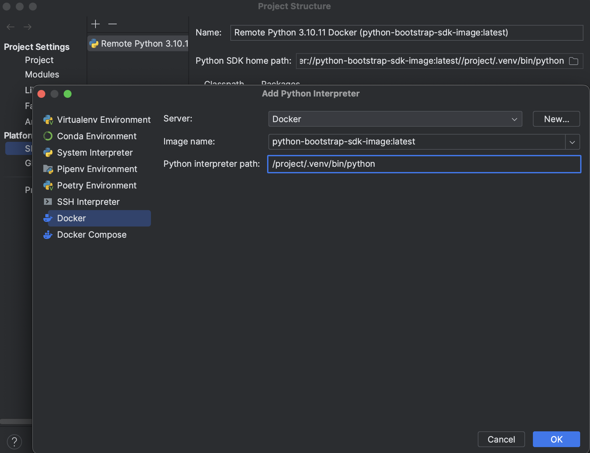

# Python Bootstrap Project
This project's goal is to create a blueprint for a python project that is being build and run exclusively on docker
engine. It helps to target one platform (e.g. linux-x64) and lock the python packages to it. For both local development
and production identical python packages will be used and there will be guarantee that if code works locally it will
work in production too.

## Pre-requirements
To set up this project on your Windows, Linux or Mac machine you don't need to have `pipenv` or `python` installed.
The only requirement is to have docker engine installed. Please follow instructions from [here](https://docs.docker.com/engine/install/)
to do so.


## Local development by IntelliJ IDEA or PyCharm
For local development first build the docker python sdk image by running:
```shell
./build.sh build-sdk
```

This command will create a docker image containing all your packages.
Then go to `Project Structure`->`SDKs`->`Add New SDK (+)`->`Add Python SDK`->`Docker`.
From there fill the values like in the screenshot:



Later chose that SDK as project default SDK and interpreter in your runtime configuration.


## Running containerized commands
Please use `./build.sh` to run the containerized commands. For example to lock the pipenv packages run:
```shell
./build.sh pipenv lock
```

Or to install a new package:
```shell
./build.sh pipenv install json3==1.0
```

**Please note** while the two example commands will be run in a docker container and update the `Pipfile` and 
`Pipfile.lock` files accordingly, they won't change the python SDK image. To get updated version of Python SDK please 
run the command from [Local development by IntelliJ IDEA or PyCharm](#Local-development-by-IntelliJ-IDEA-or-PyCharm).